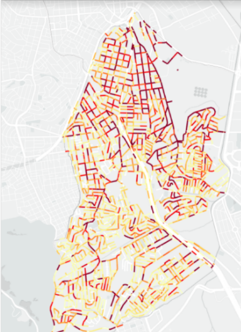
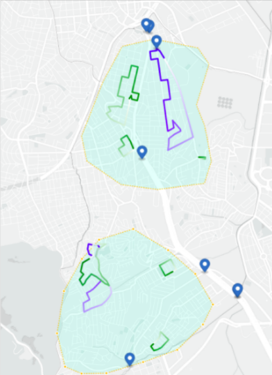

# Aluno
* 231713: Artur Abreu Hendler

# Análise do Artigo PolRoute-DS: um Dataset de Dados Criminais para Geração de Rotas de Patrulhamento Policial

| campo | valor |
|------------|----------------------------------------|
| referência |De Oliveira, D., Lage, M., Rosseti, I., & Frota, Y. (2021, August 13). PolRoute-DS.|
| link       |[Arquivo PDF](https://drive.google.com/file/d/10Q_T1TANC5BtEBpPexsTv7-gfOLva5X2/view) |
| dataset | [Diretório (arquivos CSV)](https://osf.io/mxrgu/) |
| formato | CSV |

## Resumo

Os autores,  coletando dados policiais e geogŕaficos de diversos tipos como: local de ocorrência de crimes, frequência de tipos de crimes e mapas das cidades das ocorrências desses crimes, propõe um _Dataset_ que visa auxiliar em análises para diminuição da criminalidade.
Para tal, esse _Dataset_ foi organizado misturando componentes de grafos e tabelas, relacionando localidades (vias da cidade de São Paulo) à ocorrências, tendo, no final, um estrutura em tabelas que pode ser usada para a construção de um mapa de densidade criminal (imagem 1).
Um exemplo do uso desses dados feito pelos autores é a formulação de rotas de patrulhamento eficientes e de posicionamento de policiais fixos (imagem 2).

Imagem 1             |  Imagem 2
:-------------------------:|:-------------------------:
  |  
Mais escuro - mais crimes             | Pontos azuis - policias fixos / Traços - rotas

## Perguntas de pesquisa/análises

Com esse _Dataset_ podemos auxiliar na resposta de perguntas como: Em quais regiões de determinada cidade ocorrem mais crimes? Qual caminho uma pessoa pode tomar de um ponto a outro visando segurança? Quais são os melhores pontos estratégicos para contrução de delegacias em determinada cidade?

## Trabalhos relacionados

* Yoo, J. S. (2019). Crime data warehousing and crime pattern discovery. : De forma muito semelhante aos autores, busca unir em um único lugar mapa de cidades e ocorrências criminais.
* [Crime Data-Warehouse, Royal Canadian Mounted Police](https://www.rcmp-grc.gc.ca/en/evidence-and-reports-data-warehouse): _Report_ da polícia de Burnaby, Canadá, com diversas informações sobre eventos criminosos relatados à policiais, incluindo local, região, hora, etc.
