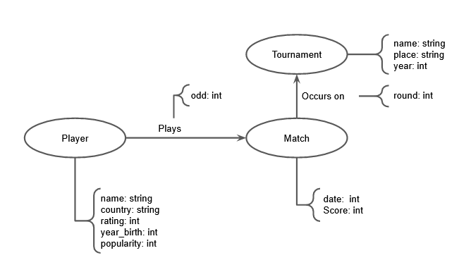

# Aluno
* 231713 : Artur Abreu Hendler

## Modelo Lógico do Banco de Dados de Grafos

## Perguntas de Pesquisa/análise

Três perguntas de pesquisa/análise:
 * Qual a chance de um jogador avançar em determinado torneio (quantidade de setas para match)?
 * Dificuldade de se avançar em um torneio em relação a outro
 * Como o local de torneio e o local de nascimento do jogador afeta seu desempenho? 
