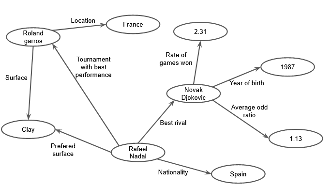

# Aluno
* 231713: Artur Abreu Hendler

## Exemplo de Grafo de Conhecimento - para publicar ou enriquecer

Como no caso de partidas de tenis nós temos vários dados da mesma natureza, como por exemplo o resultado de embate entre jogadores, não é tão interessante transformar de forma bruta as tabelas em um grafo de conhecimento. Para que obtenhamos um grafo útil, uma possibilidade seria criar, possivelmente através de médias e outras a análises de tabelas de resultados, indicadores que resumem características de jogadores. Juntando isso a dados prontos de jogadores e torneis, poderiamos ter um grafo de conhecimento como:

## Perguntas de Pesquisa ou Queries

* Idades proximas tendem a fazer com que jogadores sejam rivais?
* O que tem mais peso no torneio de melhor performance de um jogador, seu tipo de superfície ou localidade?
* Como a taxa de games (subpontuação usada no tenis) afeta a razão de odds média (odd do jogador/odd de outros jogadores) ?
